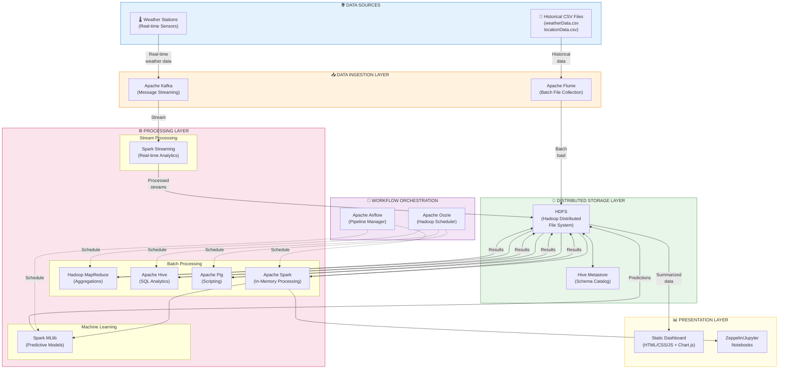

# Task 1: Solution Architecture Design

## Sri Lanka Weather Analytics Platform

### Project Overview

This document presents the solution architecture for a comprehensive Big Data analytics platform designed to process Sri Lanka's historical weather data (2010 - June 2024) across all 19 districts. The architecture handles both **continuous real-time data streams** from weather stations and **historical batch data** from CSV files, while optimizing efficiency and preventing data duplication.

### Dataset Description

| File | Description | Records |
|------|-------------|---------|
| `weatherData.csv` | Daily weather observations with 20+ meteorological parameters (temperature, precipitation, wind speed, radiation, evapotranspiration, etc.) | ~130,000+ records |
| `locationData.csv` | Geographic details with unique identifiers linking to weather data (city names, latitude, longitude, elevation) | 19 districts |

---

## [1] System Architecture Diagram



---

## [2] Component Roles and Architecture Operation

### 2.1 Data Sources Layer

| Component | Role | Description |
|-----------|------|-------------|
| **Weather Stations** | Real-time Data Producer | Automated meteorological sensors deployed across Sri Lanka's 19 districts, continuously transmitting weather measurements including temperature, precipitation, humidity, wind speed, solar radiation, and evapotranspiration readings |
| **Historical CSV Files** | Batch Data Source | Two structured files containing 14+ years of weather observations (`weatherData.csv`) and geographic reference data (`locationData.csv`) with unique location identifiers for data linkage |

---

### 2.2 Data Ingestion Layer

| Component | Role | Why This Tool? |
|-----------|------|----------------|
| **Apache Kafka** | Real-time Message Streaming | High-throughput, fault-tolerant distributed messaging system that handles continuous data streams from weather stations. Provides: <br>• Pub/sub messaging with topic partitioning by district <br>• Guaranteed message delivery with replay capability <br>• Exactly-once semantics to prevent data duplication <br>• Horizontal scalability for growing data volumes |
| **Apache Flume** | Batch Data Collection | Reliable, distributed service for collecting and aggregating large amounts of log/file data into HDFS. Provides: <br>• Configurable source-channel-sink architecture <br>• Built-in reliability with transactional data flow <br>• Efficient batch loading of CSV files <br>• Integration with HDFS for seamless storage |

---

### 2.3 Distributed Storage Layer

| Component | Role | Why This Tool? |
|-----------|------|----------------|
| **HDFS (Hadoop Distributed File System)** | Primary Distributed Storage | Scalable, fault-tolerant storage system designed for large datasets. Provides: <br>• Petabyte-scale storage capacity <br>• 3x data replication for fault tolerance <br>• Data locality for efficient processing (move computation to data) <br>• Append-only writes preventing accidental data corruption <br>• Integration with all Hadoop ecosystem tools |
| **Hive Metastore** | Schema Catalog & Metadata Management | Centralized repository for table schemas, column definitions, and partition information. Provides: <br>• Schema-on-read capability for flexible data interpretation <br>• Unified metadata access across processing engines <br>• Table partitioning support for query optimization <br>• SQL-like interface for structured data queries |

---

### 2.4 Processing Layer

#### Stream Processing

| Component | Role | Why This Tool? |
|-----------|------|----------------|
| **Spark Streaming** | Real-time Data Processing | Micro-batch stream processing engine for near real-time analytics. Provides: <br>• Sub-second latency processing <br>• Windowed aggregations (e.g., 5-minute temperature averages) <br>• Anomaly detection on live weather streams <br>• Unified API with batch Spark for code reuse <br>• Fault tolerance with checkpointing |

#### Batch Processing

| Component | Role | Why This Tool? |
|-----------|------|----------------|
| **Hadoop MapReduce** | Large-scale Batch Aggregations | Distributed processing framework for massive parallel computations. Used for: <br>• District monthly precipitation totals <br>• Mean temperature calculations per district/month <br>• Identifying month/year with highest precipitation <br>• Proven reliability for large-scale batch jobs |
| **Apache Hive** | SQL-based Analytics | Data warehouse infrastructure providing SQL-like query interface. Used for: <br>• Top 10 temperate cities ranking by max temperature <br>• Seasonal evapotranspiration calculations (Maha: Sep-Mar, Yala: Apr-Aug) <br>• Complex joins between weather and location data <br>• Ad-hoc analytical queries |
| **Apache Pig** | Scripting-based Data Transformation | High-level scripting platform for data analysis. Provides: <br>• Pig Latin scripting language for complex transformations <br>• Alternative to Hive for procedural data flows <br>• Extensible with user-defined functions (UDFs) |
| **Apache Spark** | In-Memory Processing | Fast, general-purpose cluster computing system. Used for: <br>• Shortwave radiation percentage calculations <br>• Weekly maximum temperature analysis <br>• Complex iterative algorithms (100x faster than MapReduce) <br>• DataFrame API for efficient distributed computation |

#### Machine Learning

| Component | Role | Why This Tool? |
|-----------|------|----------------|
| **Spark MLlib** | Predictive Analytics | Distributed machine learning library built on Spark. Used for: <br>• Training regression models for evapotranspiration prediction <br>• Feature engineering (precipitation_hours, sunshine_duration, wind_speed) <br>• Model evaluation (RMSE, R-squared metrics) <br>• Predicting May 2026 conditions for ET0 < 1.5mm |

---

### 2.5 Workflow Orchestration Layer

| Component | Role | Why This Tool? |
|-----------|------|----------------|
| **Apache Oozie** | Hadoop Job Scheduler | Workflow scheduler for managing Hadoop jobs. Provides: <br>• Coordination of MapReduce, Hive, and Pig jobs <br>• Job dependency management <br>• Automatic retry on failures <br>• Time-based and data-based triggers <br>• XML-based workflow definitions |
| **Apache Airflow** | Pipeline Orchestration | DAG-based workflow management platform. Provides: <br>• Python-based workflow definitions <br>• Rich web UI for monitoring and debugging <br>• Complex dependency management for Spark/ML pipelines <br>• Alerting and notification capabilities <br>• Extensible with custom operators |

---

### 2.6 Presentation Layer

| Component | Role | Why This Tool? |
|-----------|------|----------------|
| **Static Dashboard** | Data Visualization | HTML/CSS/JavaScript web application for displaying analytics results. Features: <br>• Chart.js for interactive visualizations <br>• Precipitation patterns by district and season <br>• Temperature trends and rankings <br>• Extreme weather event summaries <br>• Responsive design for desktop/mobile <br>• No server infrastructure required |
| **Zeppelin/Jupyter Notebooks** | Interactive Analysis | Web-based notebooks for exploratory data analysis. Provides: <br>• Interactive Spark, Hive, and Python execution <br>• Rich visualization capabilities <br>• Collaborative analysis environment <br>• Documentation alongside code |

---

## 3. Architecture Operation Flow

### 3.1 Real-Time Data Flow

```
Weather Stations → Apache Kafka → Spark Streaming → HDFS → Dashboard
       ↓                ↓               ↓
   (Sensors)      (Message Queue)  (Processing)    (Storage)
```

1. **Data Collection**: Weather stations transmit sensor readings to Kafka topics (partitioned by district for parallel processing)
2. **Stream Processing**: Spark Streaming consumes messages, performs windowed aggregations and anomaly detection
3. **Storage**: Processed data written to HDFS in optimized Parquet format
4. **Deduplication**: Kafka's exactly-once semantics ensure no duplicate records

### 3.2 Batch Data Flow

```
CSV Files → Apache Flume → HDFS → MapReduce/Hive/Spark → HDFS → Dashboard
    ↓            ↓          ↓            ↓                 ↓
(Historical) (Ingestion) (Raw Zone) (Processing)    (Processed Zone)
```

1. **Ingestion**: Flume loads historical CSV files into HDFS raw data zone
2. **Scheduling**: Oozie/Airflow triggers periodic batch jobs
3. **Processing**: 
   - MapReduce: District-level aggregations
   - Hive: SQL analytics and rankings
   - Spark: Complex calculations and ML training
4. **Output**: Results stored in HDFS processed zone, exported to dashboard

### 3.3 Data Deduplication Strategy

| Mechanism | Implementation |
|-----------|----------------|
| **Kafka Idempotent Producers** | Ensures exactly-once message delivery, preventing duplicate records from sensors |
| **HDFS Append-Only Writes** | Immutable file storage prevents accidental overwrites |
| **Unique Record Keys** | Composite keys (location_id + date) identify unique observations |
| **Checkpointing** | Spark Streaming checkpoints track processed offsets |

---

## 4. Architecture Benefits

| Benefit | How Achieved |
|---------|--------------|
| **Scalability** | HDFS horizontal scaling, Spark/MapReduce distributed processing |
| **Fault Tolerance** | HDFS 3x replication, Kafka message persistence, job retry mechanisms |
| **No Data Duplication** | Kafka exactly-once semantics, idempotent processing, unique keys |
| **Processing Flexibility** | Multiple engines (MapReduce, Hive, Spark) for different workloads |
| **Real-time + Batch** | Lambda architecture supporting both stream and batch processing |
| **Cost Efficiency** | Open-source tools, commodity hardware, data locality optimization |

---

## 5. Technology Stack Summary

| Layer | Technologies |
|-------|--------------|
| **Data Sources** | Weather Sensors, CSV Files |
| **Ingestion** | Apache Kafka, Apache Flume |
| **Storage** | HDFS, Hive Metastore |
| **Processing** | Hadoop MapReduce, Apache Hive, Apache Pig, Apache Spark, Spark MLlib |
| **Orchestration** | Apache Oozie, Apache Airflow |
| **Presentation** | Static Dashboard (HTML/CSS/JS), Zeppelin/Jupyter Notebooks |

---

*This architecture design provides a scalable, fault-tolerant, and efficient solution for processing Sri Lanka's weather data, supporting both real-time monitoring and historical batch analysis while preventing data duplication through idempotent processing mechanisms.*
